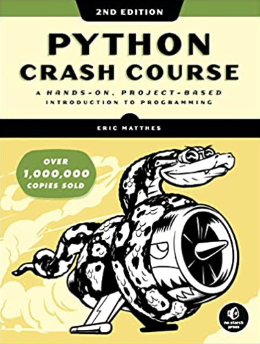
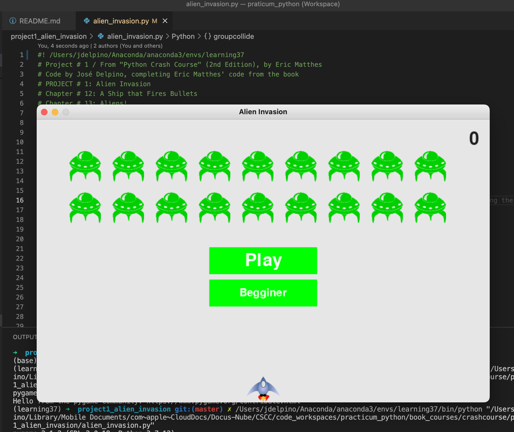
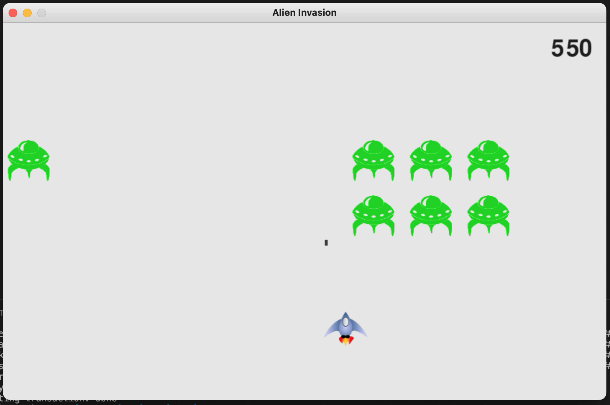
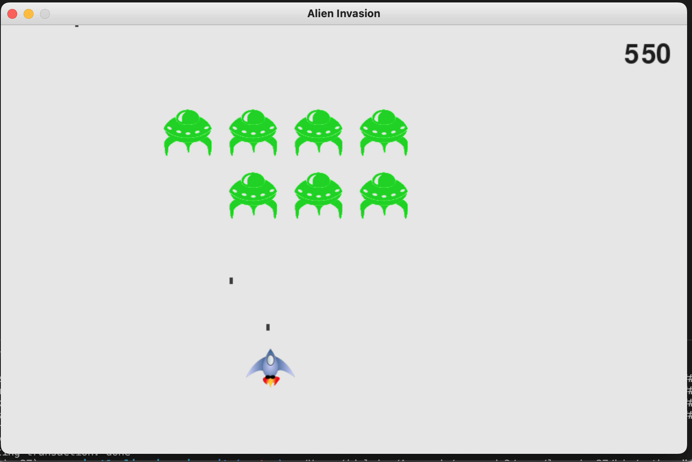
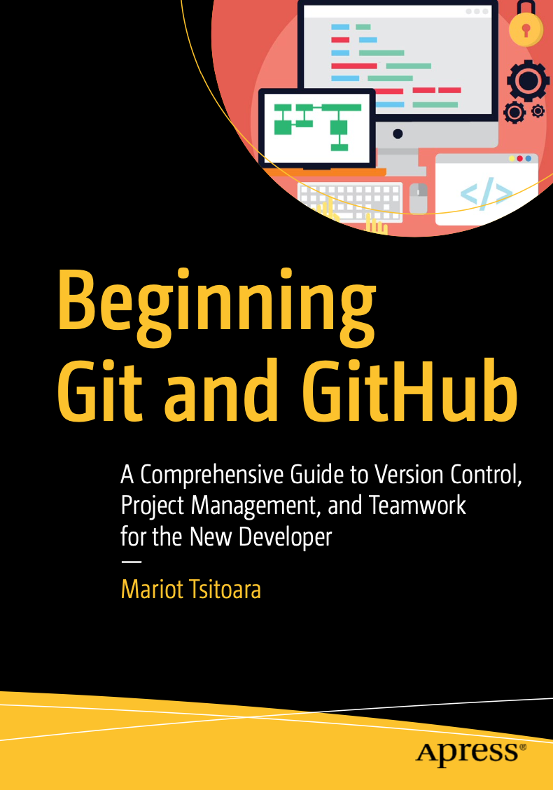

# Alien Invasion Game Project
## Project from *Python Crash Course* (2019) (2nd Edition), by Eric Matthes

I completed the first part of this alien invasion game project completing the basic code the book provides.
The game is built using Pygame, which is also a fun way to learn basics of object oriented programming.

By the way, *Python crash course* is a very nice book for python begginners and it provides a wide variety of projects.
If you want to learn hand-on and you don't know anythong about python, you can have fun completing one or more
projects from the book.

Here some screenshots of the game working!

For this project I also used Git for the first time, commiting my changes, and synchronizing the project on my computer
with my github! I learned a lot about Git with the help of this book:

